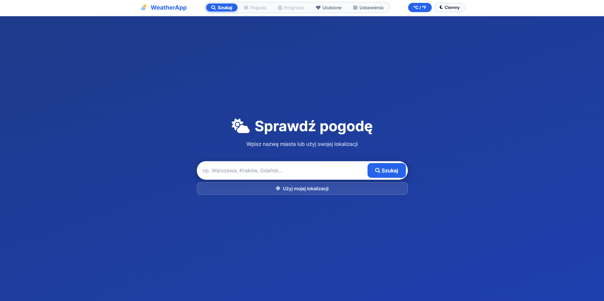
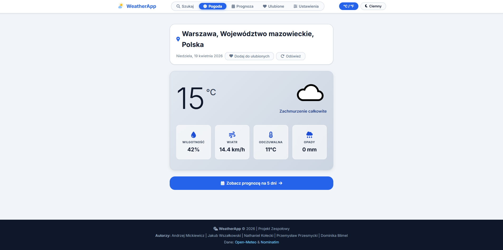
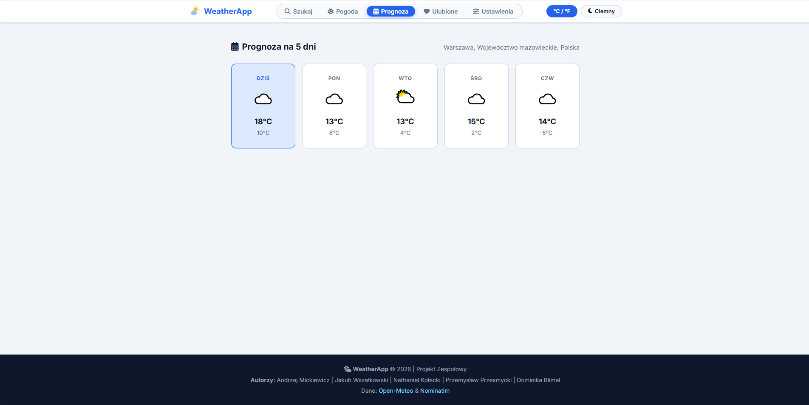
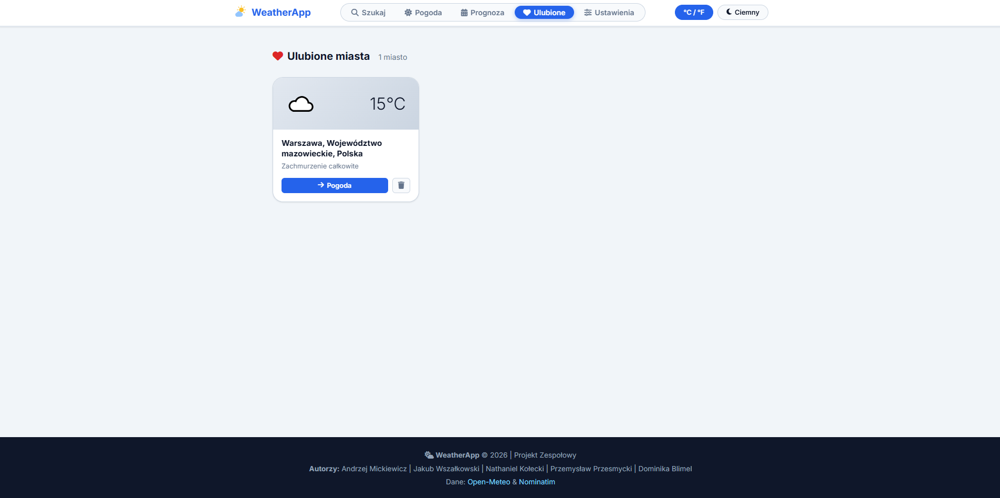
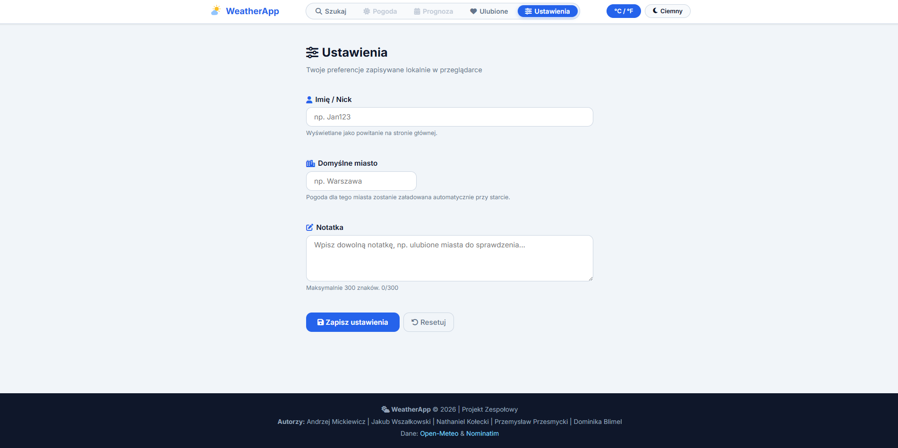

# WeatherApp – Prognoza Pogody

Aplikacja webowa wyświetlająca aktualną pogodę i prognozę na 5 dni dla dowolnego miasta na świecie. Dane pobierane są z bezpłatnego Open-Meteo API (brak wymaganego klucza API).

## Autorzy

- Andrzej Mickiewicz (Team Leader) – GitHub: @endy0216
- Jakub Wszałkowski (Frontend Dev 1) – GitHub: @kuba00272
- Nathaniel Kołecki (JavaScript Dev) – GitHub: @nathanielkolecki-ops
- Przemysław Przesmycki (Frontend Dev 2) – GitHub: @username

## Technologie

- HTML5 (semantyczne znaczniki)
- CSS3 (Flexbox, CSS Grid, CSS Variables, Animations)
- JavaScript ES6+ (Vanilla JS, bez frameworków)
- [Open-Meteo](https://open-meteo.com/) API – pogoda (bezpłatne)
- [Open-Meteo Geocoding](https://open-meteo.com/en/docs/geocoding-api) API – wyszukiwanie miast
- [Nominatim](https://nominatim.openstreetmap.org/) – odwrotne geokodowanie (lokalizacja)
- Font Awesome 6 – ikony
- Google Fonts (Inter)

## Funkcjonalności

- [x] Wyszukiwanie miasta z walidacją (RegExp) i podpowiedziami (autocomplete)
- [x] Aktualna pogoda: temperatura, wilgotność, wiatr, opady, temperatura odczuwalna
- [x] Prognoza na 5 dni z ikonami i zakresem temperatur
- [x] Przełącznik °C / °F
- [x] Motyw jasny / ciemny (Dark mode) – zapisywany w localStorage
- [x] Geolokalizacja – pogoda dla bieżącej pozycji użytkownika
- [x] Dynamiczne tło zmieniające się w zależności od warunków pogodowych
- [x] Historia ostatnich wyszukiwań (localStorage)
- [x] Ulubione miasta – dodawanie/usuwanie, zapis w localStorage
- [x] Modal ze szczegółami wybranego dnia prognozy
- [x] Formularz ustawień (domyślne miasto, nick, notatka) z walidacją RegExp
- [x] Responsywność (mobile / tablet / desktop)
- [x] Dostępność (aria-*, role, focus management)

## Wymagania spełnione (z PDF)

### HTML5
- Semantyczne znaczniki: `<header>`, `<nav>`, `<main>`, `<section>`, `<article>`, `<footer>`
- Meta tagi: viewport, description
- Atrybuty alt, aria-label, aria-live, role

### CSS3
- CSS Variables (`:root`)
- Flexbox w 40+ miejscach
- CSS Grid w 4 miejscach (weather-details, forecast-grid, modal-body, favorites-grid)
- Media queries: 3 breakpointy (< 600px, ≥ 600px, ≥ 900px)
- Transitions w 6+ miejscach
- Animations: `float`, `spin`, `fadeIn`, `fadeInUp`, `slideDown`, `scaleIn`

### JavaScript
- Manipulacja DOM (querySelector, createElement, classList)
- 20 event listenerów (submit, input, click, keydown, scroll, blur)
- Walidacja formularza z 3+ polami i RegExp (`/^[a-zA-ZąćęłńóśźżĄĆĘŁŃÓŚŹŻ\s\-]{2,60}$/`)
- `event.preventDefault()`
- Fetch API (Open-Meteo, Nominatim)
- localStorage (preferencje, historia, ulubione, ustawienia)

### Interaktywność (6 z wymaganych 3)
1. Autocomplete z debounce (dynamiczne dodawanie/usuwanie elementów)
2. Dark mode / theme switcher
3. °C/°F switcher
4. Modal/popup (szczegóły dnia prognozy)
5. Geolokalizacja (Geolocation API)
6. Real-time validation (licznik znaków, walidacja per-pole)

## Instalacja

1. Sklonuj repozytorium:
   ```bash
   git clone https://github.com/username/weatherapp.git
   ```
2. Otwórz `index.html` w przeglądarce (Chrome lub Firefox)

> Nie wymaga serwera ani klucza API. Działa lokalnie.

## Link do live demo

[https://endy0216.github.io/weatherapp/](https://endy0216.github.io/weatherapp/)

## Screenshots

### Zakładka Szukaj


### Zakładka Pogoda


### Zakładka Prognoza


### Zakładka Ulubione


### Zakładka Ustawienia

